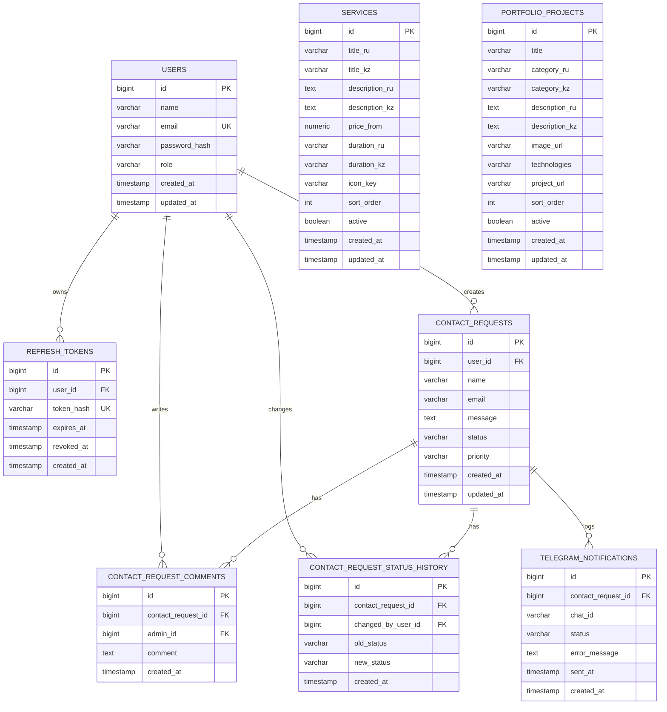

# RemoteP ER Diagram

This version is readable in Markdown and can be copied into a diploma document that supports Mermaid.

## Relationships

- One user can have many refresh tokens.
- One user can create many contact requests.
- One contact request can have many admin comments.
- One contact request can have many status history records.
- One contact request can have many Telegram notification logs.
- `services` and `portfolio_projects` are content tables for the public website.
